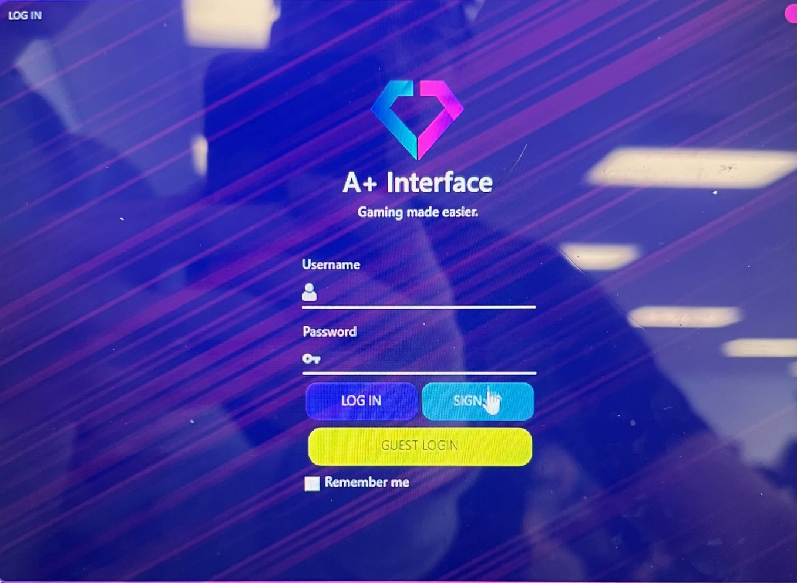

[![Contributors][contributors-shield]][contributors-url]
[![Forks][forks-shield]][forks-url]
[![Stargazers][stars-shield]][stars-url]
[![Issues][issues-shield]][issues-url]
[![MIT License][license-shield]][license-url]
[![LinkedIn][linkedin-shield]][linkedin-url]

<!-- PROJECT LOGO -->
 

  

<h3 align="center">Game Launcher</h3>

  

    User Interface design built using WPF C#. This project features user functions such as Login, Signup, Reset Password and Remember me. Data is not stored externally, but
    is stored 'locally' in the project directory. This project features Snake, Tetris and TicTacToe. Scores for each game are stored, and Users are presented in descending order on the Leaderboard page.
     
     
    <a href="https://github.com/DarmorGamz/Game-Launcher">View Demo</a>
    ·
    <a href="https://github.com/DarmorGamz/Game-Launcher/issues">Report Bug</a>
    ·
    <a href="https://github.com/DarmorGamz/Game-Launcher/issues">Request Feature</a>
  

<!-- TABLE OF CONTENTS -->

  
Table of Contents

  <ol>
    <li>
      <a href="#demo-pictures">Demo Pictures</a>
      <ul>
        <li><a href="#built-with">Built With</a></li>
      </ul>
    </li>
    <li>
      <a href="#getting-started">Getting Started</a>
      <ul>
        <li><a href="#prerequisites">Prerequisites</a></li>
        <li><a href="#installation">Installation</a></li>
      </ul>
    </li>
    <li><a href="#contributing">Contributing</a></li>
    <li><a href="#license">License</a></li>
    <li><a href="#contact">Contact</a></li>
    <li><a href="#acknowledgments">Acknowledgments</a></li>
  </ol>

<!-- ABOUT THE PROJECT -->
## Demo Pictures

Sign Up Page
 

Log In Page
 

Profile Viewer
 

Profile Editor
 

Games
 

Leaderboard
 

### Built With

[![C#][C#.com]][C#-url] [![MYSQL.com]][MYSQL-url]

(<a href="#readme-top">back to top</a>)

<!-- GETTING STARTED -->
## Getting Started

This is an example of how you may give instructions on setting up your project locally.
To get a local copy up and running follow these simple example steps.

### Prerequisites

### Installation

(<a href="#readme-top">back to top</a>)

<!-- CONTRIBUTING -->
## Contributing

Contributions are what make the open source community such an amazing place to learn, inspire, and create. Any contributions you make are **greatly appreciated**.

If you have a suggestion that would make this better, please fork the repo and create a pull request. You can also simply open an issue with the tag "enhancement".
Don't forget to give the project a star! Thanks again!

1. Fork the Project
2. Create your Feature Branch (`git checkout -b feature/AmazingFeature`)
3. Commit your Changes (`git commit -m 'Add some AmazingFeature'`)
4. Push to the Branch (`git push origin feature/AmazingFeature`)
5. Open a Pull Request

(<a href="#readme-top">back to top</a>)

<!-- LICENSE -->
## License

Distributed under the GPL License. See `LICENSE.txt` for more information.

(<a href="#readme-top">back to top</a>)

<!-- CONTACT -->
## Contact

Darren Morrison - darren09@live.ca  
Carter Glynn - carter.glynn14@gmail.com  

Project Link: [https://github.com/DarmorGamz/Game-Launcher](https://github.com/DarmorGamz/Game-Launcher)

(<a href="#readme-top">back to top</a>)

<!-- ACKNOWLEDGMENTS -->
## Acknowledgments

(<a href="#readme-top">back to top</a>)

<!-- MARKDOWN LINKS & IMAGES -->
<!-- https://www.markdownguide.org/basic-syntax/#reference-style-links -->
[contributors-shield]: https://img.shields.io/github/contributors/DarmorGamz/Game-Launcher.svg?style=for-the-badge
[contributors-url]: https://github.com/DarmorGamz/Game-Launcher/graphs/contributors
[forks-shield]: https://img.shields.io/github/forks/DarmorGamz/Game-Launcher.svg?style=for-the-badge
[forks-url]: https://github.com/DarmorGamz/Game-Launcher/network/members
[stars-shield]: https://img.shields.io/github/stars/DarmorGamz/Game-Launcher.svg?style=for-the-badge
[stars-url]: https://github.com/DarmorGamz/Game-Launcher/stargazers
[issues-shield]: https://img.shields.io/github/issues/DarmorGamz/Game-Launcher.svg?style=for-the-badge
[issues-url]: https://github.com/DarmorGamz/Game-Launcher/issues
[license-shield]: https://img.shields.io/github/license/DarmorGamz/Game-Launcher.svg?style=for-the-badge
[license-url]: https://github.com/DarmorGamz/Game-Launcher/blob/master/LICENSE.txt
[linkedin-shield]: https://img.shields.io/badge/-LinkedIn-black.svg?style=for-the-badge&logo=linkedin&colorB=555
[linkedin-url]: https://linkedin.com/in/darren--morrison
[product-screenshot]: images/screenshot.png

[C.com]: https://img.shields.io/badge/c-%2300599C.svg?style=for-the-badge&logo=c&logoColor=white
[C-url]: https://www.cprogramming.com
[PHP.com]: https://img.shields.io/badge/php-%23777BB4.svg?style=for-the-badge&logo=php&logoColor=white
[PHP-url]: https://www.php.net/
[MYSQL.com]: https://img.shields.io/badge/mysql-%2300f.svg?style=for-the-badge&logo=mysql&logoColor=white
[MYSQL-url]: https://www.mysql.com/
[HTML.com]: https://img.shields.io/badge/html5-%23E34F26.svg?style=for-the-badge&logo=html5&logoColor=white
[HTML-url]: https://www.w3.org/html/#:~:text=W3C%20HTML&text=https%3A%2F%2Fhtml.spec.whatwg,is%20the%20current%20HTML%20standard.
[CSS3.com]: https://img.shields.io/badge/css3-%231572B6.svg?style=for-the-badge&logo=css3&logoColor=white
[CSS3-url]: https://www.css3.com/
[JavaScript.com]: https://img.shields.io/badge/javascript-%23323330.svg?style=for-the-badge&logo=javascript&logoColor=%23F7DF1E
[JavaScript-url]: https://www.javascript.com/
[C#.com]: https://img.shields.io/badge/c%23-%23239120.svg?style=for-the-badge&logo=c-sharp&logoColor=white 
[C#-url]: https://learn.microsoft.com/en-us/dotnet/csharp/

[Linux.com]: https://img.shields.io/badge/Linux-FCC624?style=for-the-badge&logo=linux&logoColor=black
[Linux-url]: https://aws.amazon.com/amazon-linux-2/

[AWS.com]: https://img.shields.io/badge/AWS-%23FF9900.svg?style=for-the-badge&logo=amazon-aws&logoColor=white
[AWS-url]: https://aws.amazon.com/

[PHPStorm.com]: https://img.shields.io/badge/phpstorm-143?style=for-the-badge&logo=phpstorm&logoColor=black&color=black&labelColor=darkorchid
[PHPStorm-url]: https://www.jetbrains.com/phpstorm/
